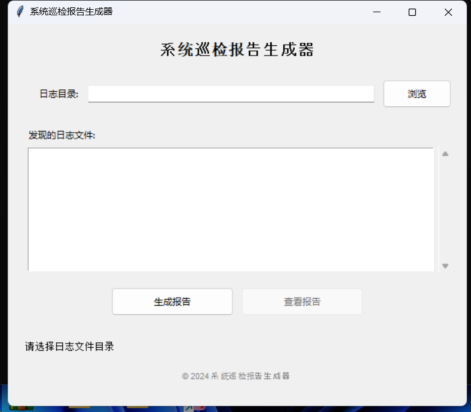
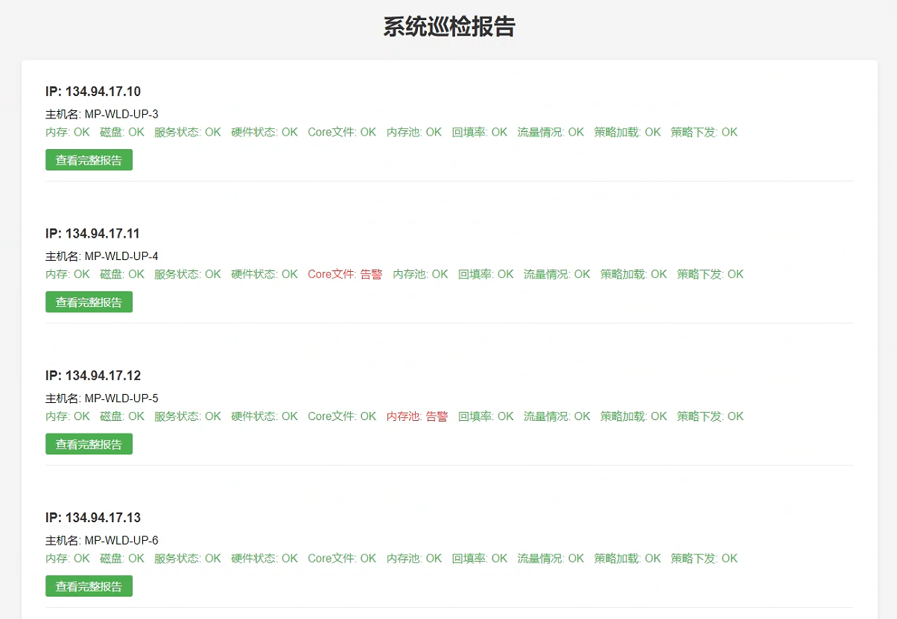

# 系统巡检报告生成器使用说明

### 系统巡检报告生成器使用说明

#### 一、软件介绍

系统巡检报告生成器是一款用于自动化生成系统巡检报告的工具。该工具支持从指定的日志文件中提取系统信息，并生成HTML格式的巡检报告，方便用户查看和管理。报告内容包括系统的基本信息、资源使用情况、服务状态等，并且能够根据不同的状态（正常、告警）自动调整显示颜色。

#### 二、软件使用

1. **启动软件**：  
    软件由Python编写，已打包成系统巡检报告生成器.exe，双击打开：

    ​​
2. **选择日志文件目录**：  
    程序启动后，会显示一个图形用户界面（GUI）。点击“浏览”按钮，选择包含巡检日志文件的目录。日志文件应以 `.log`​ 或 `.log.txt`​ 为扩展名。
3. **检查日志文件**：  
    选择目录后，程序会自动检查该目录下的日志文件，并在文件列表框中显示找到的日志文件。如果没有找到日志文件，会显示“未找到日志文件”。
4. **生成报告**：  
    点击“生成报告”按钮，程序会开始解析日志文件并生成HTML报告。报告生成过程中，状态栏会显示当前的处理进度。生成完成后，状态栏会显示“成功生成报告！”。
5. **查看报告**：  
    生成报告后，点击“查看报告”按钮，程序会使用默认的浏览器打开 `index.html`​ 文件，该文件包含了所有设备的巡检报告汇总。
6. **设备卡片**：  
    在 `index.html`​ 页面中，每个设备会显示一个卡片，包含设备的IP地址、主机名、巡检时间以及各部分的摘要信息。摘要信息中如果有告警，会显示为红色，正常状态显示为绿色。点击摘要信息中的链接，可以跳转到该设备的详细报告页面。
7. **设备详细报告**：  
    在设备的详细报告页面中，可以查看每个巡检部分的详细信息。页面顶部有返回设备列表的链接。每个部分的标题可以点击展开或折叠内容。如果有告警信息，部分的标题和内容背景会显示为红色。
8. **全部展开/折叠**：  
    在设备详细报告页面中，可以使用“全部展开”和“全部折叠”按钮来快速展开或折叠所有部分。

    ​​

#### 三、示例

1. **日志文件示例**：

    ```plaintext
    系统巡检报告 | 2023-10-01 12:00:00 =====
    主机名: server1
    系统版本: Red Hat Enterprise Linux 8.4 (Ootpa)
    内存使用: 75.3%
    磁盘使用: 82.1%
    系统运行时间: 30天12小时30分钟
    服务状态: 
    ---- 服务状态 ----
    updpi.service: active (运行时间: 29天23小时59分钟)
    upp.service: active (运行时间: 30天00小时01分钟)
    upload.service: inactive
    logtar.service: active (运行时间: 30天00小时01分钟)
    tnlinfo_proxy.service: active (运行时间: 30天00小时01分钟)
    ---- 服务状态 ----
    硬件状态: OK
    Core文件: 无
    内存池: [告警] Updpi内存池使用率超过80%
    回填率: 98.5%
    流量情况: 正常
    策略加载: 1000条策略加载成功
    策略下发: 998条策略下发成功
    巡检总结: 内存: OK, 磁盘: 告警, 服务状态: 告警, 硬件状态: OK, Core文件: OK, 内存池: 告警, 回填率: OK, 流量情况: OK, 策略加载: OK, 策略下发: OK
    ```
2. **生成的HTML报告示例**：

    * **索引页面**：包含所有设备的卡片，每个卡片显示设备的基本信息和摘要。
    * **设备详细页面**：包含设备的详细巡检信息，每个部分可以展开或折叠查看内容。

      ​​

#### 四、常见问题

1. **无法生成报告**：

    * 确保选择了正确的日志文件目录。
    * 确保日志文件格式正确。
    * 检查是否有足够的权限执行系统命令。
2. **报告打开失败**：

    * 确保报告文件生成成功。
    * 确保浏览器能够正确解析生成的HTML文件。
3. **日志文件解析错误**：

    * 检查日志文件内容是否符合预期格式。
    * 确保日志文件的编码为UTF-8。

---

希望这份使用说明能帮助您更好地使用系统巡检报告生成器。如果有任何疑问或需要进一步的帮助，请随时联系开发者。

‍
